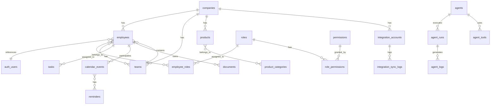

# Доменная модель Wookiee Dashboard Platform

## Обзор

Доменная модель описывает корпоративное ядро данных (Core) платформы. Все модули используют эти базовые сущности через Core SDK.

## Принципы

1. **Мульти-компании заложены**, но по умолчанию работает одна компания
2. **Все данные защищены через RLS** (Row Level Security)
3. **Связь с Supabase Auth**: `core.employees.user_id` → `auth.users.id`
4. **Модули расширяют Core**, но не изменяют базовые таблицы

## Диаграмма доменной модели



## Основные сущности

### 1. Companies (Организации)

**Таблица**: `core.companies`

```sql
CREATE TABLE core.companies (
    id UUID PRIMARY KEY DEFAULT gen_random_uuid(),
    name TEXT NOT NULL,
    slug TEXT UNIQUE NOT NULL,  -- URL-friendly идентификатор
    domain TEXT,  -- домен компании (для автоматической привязки)
    settings JSONB DEFAULT '{}',
    created_at TIMESTAMPTZ DEFAULT NOW(),
    updated_at TIMESTAMPTZ DEFAULT NOW()
);
```

**Назначение**: Корневая сущность для мульти-компаний. По умолчанию создаётся одна компания.

**RLS**: Администраторы компании могут читать/изменять только свою компанию.

---

### 2. Employees (Сотрудники)

**Таблица**: `core.employees`

```sql
CREATE TABLE core.employees (
    id UUID PRIMARY KEY DEFAULT gen_random_uuid(),
    company_id UUID NOT NULL REFERENCES core.companies(id) ON DELETE CASCADE,
    user_id UUID UNIQUE REFERENCES auth.users(id) ON DELETE CASCADE,
    
    -- Профиль
    email TEXT NOT NULL,
    full_name TEXT NOT NULL,
    first_name TEXT,
    last_name TEXT,
    avatar_url TEXT,
    phone TEXT,
    position TEXT,
    
    -- Статус
    status TEXT DEFAULT 'active',  -- active, inactive, archived
    last_login_at TIMESTAMPTZ,
    
    -- Метаданные
    metadata JSONB DEFAULT '{}',  -- дополнительные поля
    created_at TIMESTAMPTZ DEFAULT NOW(),
    updated_at TIMESTAMPTZ DEFAULT NOW(),
    
    UNIQUE(company_id, email)
);

CREATE INDEX idx_employees_company_id ON core.employees(company_id);
CREATE INDEX idx_employees_user_id ON core.employees(user_id);
CREATE INDEX idx_employees_email ON core.employees(email);
```

**Назначение**: Профиль сотрудника, связь с `auth.users` через `user_id`.

**RLS**: 
- Сотрудник может читать свой профиль
- Сотрудники компании могут читать профили коллег (только базовые поля)
- Менеджеры могут изменять профили подчинённых

---

### 3. Teams (Команды/Отделы)

**Таблица**: `core.teams`

```sql
CREATE TABLE core.teams (
    id UUID PRIMARY KEY DEFAULT gen_random_uuid(),
    company_id UUID NOT NULL REFERENCES core.companies(id) ON DELETE CASCADE,
    
    name TEXT NOT NULL,
    slug TEXT NOT NULL,
    description TEXT,
    parent_team_id UUID REFERENCES core.teams(id) ON DELETE SET NULL,  -- иерархия
    
    manager_id UUID REFERENCES core.employees(id) ON DELETE SET NULL,
    
    metadata JSONB DEFAULT '{}',
    created_at TIMESTAMPTZ DEFAULT NOW(),
    updated_at TIMESTAMPTZ DEFAULT NOW(),
    
    UNIQUE(company_id, slug)
);

CREATE INDEX idx_teams_company_id ON core.teams(company_id);
CREATE INDEX idx_teams_parent_team_id ON core.teams(parent_team_id);
```

**Связь многие-ко-многим с Employees:**

**Таблица**: `core.employee_teams`

```sql
CREATE TABLE core.employee_teams (
    employee_id UUID NOT NULL REFERENCES core.employees(id) ON DELETE CASCADE,
    team_id UUID NOT NULL REFERENCES core.teams(id) ON DELETE CASCADE,
    role TEXT DEFAULT 'member',  -- member, lead
    joined_at TIMESTAMPTZ DEFAULT NOW(),
    PRIMARY KEY (employee_id, team_id)
);
```

---

### 4. Roles & Permissions (RBAC)

**Таблица**: `core.roles`

```sql
CREATE TABLE core.roles (
    id UUID PRIMARY KEY DEFAULT gen_random_uuid(),
    company_id UUID NOT NULL REFERENCES core.companies(id) ON DELETE CASCADE,
    
    name TEXT NOT NULL,
    slug TEXT NOT NULL,  -- admin, manager, employee, viewer
    description TEXT,
    is_system BOOLEAN DEFAULT FALSE,  -- системные роли (нельзя удалить)
    
    metadata JSONB DEFAULT '{}',
    created_at TIMESTAMPTZ DEFAULT NOW(),
    updated_at TIMESTAMPTZ DEFAULT NOW(),
    
    UNIQUE(company_id, slug)
);
```

**Таблица**: `core.permissions`

```sql
CREATE TABLE core.permissions (
    id UUID PRIMARY KEY DEFAULT gen_random_uuid(),
    
    resource TEXT NOT NULL,  -- employees, products, tasks, etc.
    action TEXT NOT NULL,    -- read, write, delete, manage
    scope TEXT DEFAULT 'own',  -- own, team, company
    
    description TEXT,
    created_at TIMESTAMPTZ DEFAULT NOW(),
    
    UNIQUE(resource, action, scope)
);
```

**Связь ролей и прав:**

**Таблица**: `core.role_permissions`

```sql
CREATE TABLE core.role_permissions (
    role_id UUID NOT NULL REFERENCES core.roles(id) ON DELETE CASCADE,
    permission_id UUID NOT NULL REFERENCES core.permissions(id) ON DELETE CASCADE,
    PRIMARY KEY (role_id, permission_id)
);
```

**Назначение ролей сотрудникам:**

**Таблица**: `core.employee_roles`

```sql
CREATE TABLE core.employee_roles (
    employee_id UUID NOT NULL REFERENCES core.employees(id) ON DELETE CASCADE,
    role_id UUID NOT NULL REFERENCES core.roles(id) ON DELETE CASCADE,
    assigned_at TIMESTAMPTZ DEFAULT NOW(),
    assigned_by UUID REFERENCES core.employees(id),
    PRIMARY KEY (employee_id, role_id)
);
```

**Системные роли (seed данные):**
- `admin` - полный доступ к компании
- `manager` - управление командами и задачами
- `employee` - базовые права
- `viewer` - только чтение

---

### 5. Products (Продукты)

**Таблица**: `core.products`

```sql
CREATE TABLE core.products (
    id UUID PRIMARY KEY DEFAULT gen_random_uuid(),
    company_id UUID NOT NULL REFERENCES core.companies(id) ON DELETE CASCADE,
    
    name TEXT NOT NULL,
    slug TEXT NOT NULL,
    description TEXT,
    sku TEXT,
    price DECIMAL(12, 2),
    currency TEXT DEFAULT 'RUB',
    
    status TEXT DEFAULT 'active',  -- active, archived
    metadata JSONB DEFAULT '{}',
    
    created_at TIMESTAMPTZ DEFAULT NOW(),
    updated_at TIMESTAMPTZ DEFAULT NOW(),
    
    UNIQUE(company_id, slug)
);
```

**Категории продуктов:**

**Таблица**: `core.product_categories`

```sql
CREATE TABLE core.product_categories (
    id UUID PRIMARY KEY DEFAULT gen_random_uuid(),
    company_id UUID NOT NULL REFERENCES core.companies(id) ON DELETE CASCADE,
    
    name TEXT NOT NULL,
    slug TEXT NOT NULL,
    parent_category_id UUID REFERENCES core.product_categories(id) ON DELETE SET NULL,
    
    UNIQUE(company_id, slug)
);
```

**Связь продуктов и категорий:**

**Таблица**: `core.product_category_memberships`

```sql
CREATE TABLE core.product_category_memberships (
    product_id UUID NOT NULL REFERENCES core.products(id) ON DELETE CASCADE,
    category_id UUID NOT NULL REFERENCES core.product_categories(id) ON DELETE CASCADE,
    PRIMARY KEY (product_id, category_id)
);
```

---

### 6. Documents (Документы/Файлы)

**Таблица**: `core.documents`

```sql
CREATE TABLE core.documents (
    id UUID PRIMARY KEY DEFAULT gen_random_uuid(),
    company_id UUID NOT NULL REFERENCES core.companies(id) ON DELETE CASCADE,
    
    name TEXT NOT NULL,
    file_path TEXT NOT NULL,  -- путь в Supabase Storage
    file_size BIGINT,
    mime_type TEXT,
    
    owner_id UUID NOT NULL REFERENCES core.employees(id),
    
    -- Метаданные
    metadata JSONB DEFAULT '{}',
    tags TEXT[],
    
    created_at TIMESTAMPTZ DEFAULT NOW(),
    updated_at TIMESTAMPTZ DEFAULT NOW()
);

CREATE INDEX idx_documents_company_id ON core.documents(company_id);
CREATE INDEX idx_documents_owner_id ON core.documents(owner_id);
```

**Назначение**: Метаданные файлов в Supabase Storage. Файлы хранятся в бакетах: `companies/{company_id}/documents/`

---

### 7. Integration Accounts (Интеграции)

**Таблица**: `core.integration_accounts`

```sql
CREATE TABLE core.integration_accounts (
    id UUID PRIMARY KEY DEFAULT gen_random_uuid(),
    company_id UUID NOT NULL REFERENCES core.companies(id) ON DELETE CASCADE,
    
    provider TEXT NOT NULL,  -- bitrix24, telegram, google_calendar, etc.
    name TEXT NOT NULL,
    
    -- Учётные данные (зашифрованы)
    credentials JSONB NOT NULL,  -- {webhook_url, api_key, etc.}
    
    -- Статус
    status TEXT DEFAULT 'active',  -- active, inactive, error
    last_sync_at TIMESTAMPTZ,
    last_error TEXT,
    
    -- Настройки
    settings JSONB DEFAULT '{}',
    metadata JSONB DEFAULT '{}',
    
    created_at TIMESTAMPTZ DEFAULT NOW(),
    updated_at TIMESTAMPTZ DEFAULT NOW(),
    
    UNIQUE(company_id, provider, name)
);

CREATE INDEX idx_integration_accounts_company_id ON core.integration_accounts(company_id);
CREATE INDEX idx_integration_accounts_provider ON core.integration_accounts(provider);
```

**Логи синхронизации:**

**Таблица**: `core.integration_sync_logs`

```sql
CREATE TABLE core.integration_sync_logs (
    id UUID PRIMARY KEY DEFAULT gen_random_uuid(),
    integration_account_id UUID NOT NULL REFERENCES core.integration_accounts(id) ON DELETE CASCADE,
    
    sync_type TEXT NOT NULL,  -- full, incremental, manual
    status TEXT NOT NULL,     -- success, error, partial
    records_synced INTEGER DEFAULT 0,
    error_message TEXT,
    
    started_at TIMESTAMPTZ DEFAULT NOW(),
    completed_at TIMESTAMPTZ,
    metadata JSONB DEFAULT '{}'
);

CREATE INDEX idx_integration_sync_logs_account_id ON core.integration_sync_logs(integration_account_id);
CREATE INDEX idx_integration_sync_logs_started_at ON core.integration_sync_logs(started_at);
```

---

### 8. Tasks (Задачи)

**Таблица**: `core.tasks`

```sql
CREATE TABLE core.tasks (
    id UUID PRIMARY KEY DEFAULT gen_random_uuid(),
    company_id UUID NOT NULL REFERENCES core.companies(id) ON DELETE CASCADE,
    
    title TEXT NOT NULL,
    description TEXT,
    status TEXT DEFAULT 'new',  -- new, in_progress, completed, cancelled
    
    -- Назначение
    assignee_id UUID REFERENCES core.employees(id),
    creator_id UUID NOT NULL REFERENCES core.employees(id),
    
    -- Сроки
    due_date TIMESTAMPTZ,
    completed_at TIMESTAMPTZ,
    
    -- Приоритет
    priority TEXT DEFAULT 'normal',  -- low, normal, high, urgent
    
    -- Связи
    parent_task_id UUID REFERENCES core.tasks(id) ON DELETE SET NULL,
    project_id UUID,  -- ссылка на проекты (если нужны)
    
    metadata JSONB DEFAULT '{}',
    created_at TIMESTAMPTZ DEFAULT NOW(),
    updated_at TIMESTAMPTZ DEFAULT NOW()
);

CREATE INDEX idx_tasks_company_id ON core.tasks(company_id);
CREATE INDEX idx_tasks_assignee_id ON core.tasks(assignee_id);
CREATE INDEX idx_tasks_due_date ON core.tasks(due_date);
```

---

### 9. Calendar Events (События календаря)

**Таблица**: `core.calendar_events`

```sql
CREATE TABLE core.calendar_events (
    id UUID PRIMARY KEY DEFAULT gen_random_uuid(),
    company_id UUID NOT NULL REFERENCES core.companies(id) ON DELETE CASCADE,
    
    title TEXT NOT NULL,
    description TEXT,
    location TEXT,  -- для ссылок на телемост
    
    -- Время
    start_at TIMESTAMPTZ NOT NULL,
    end_at TIMESTAMPTZ NOT NULL,
    timezone TEXT DEFAULT 'UTC',
    all_day BOOLEAN DEFAULT FALSE,
    
    -- Организатор и участники
    organizer_id UUID NOT NULL REFERENCES core.employees(id),
    
    -- Статус
    status TEXT DEFAULT 'scheduled',  -- scheduled, cancelled, completed
    
    -- Внешние ссылки
    external_id TEXT,  -- ID в внешней системе (Bitrix24, Google Calendar)
    external_provider TEXT,  -- bitrix24, google_calendar, etc.
    
    metadata JSONB DEFAULT '{}',
    created_at TIMESTAMPTZ DEFAULT NOW(),
    updated_at TIMESTAMPTZ DEFAULT NOW()
);

CREATE INDEX idx_calendar_events_company_id ON core.calendar_events(company_id);
CREATE INDEX idx_calendar_events_start_at ON core.calendar_events(start_at);
CREATE INDEX idx_calendar_events_organizer_id ON core.calendar_events(organizer_id);
```

**Участники событий:**

**Таблица**: `core.calendar_event_participants`

```sql
CREATE TABLE core.calendar_event_participants (
    event_id UUID NOT NULL REFERENCES core.calendar_events(id) ON DELETE CASCADE,
    employee_id UUID NOT NULL REFERENCES core.employees(id) ON DELETE CASCADE,
    status TEXT DEFAULT 'pending',  -- pending, accepted, declined
    PRIMARY KEY (event_id, employee_id)
);
```

**Напоминания:**

**Таблица**: `core.reminders`

```sql
CREATE TABLE core.reminders (
    id UUID PRIMARY KEY DEFAULT gen_random_uuid(),
    
    entity_type TEXT NOT NULL,  -- task, calendar_event
    entity_id UUID NOT NULL,
    
    employee_id UUID NOT NULL REFERENCES core.employees(id) ON DELETE CASCADE,
    
    remind_at TIMESTAMPTZ NOT NULL,
    reminded BOOLEAN DEFAULT FALSE,
    
    created_at TIMESTAMPTZ DEFAULT NOW()
);

CREATE INDEX idx_reminders_employee_id ON core.reminders(employee_id);
CREATE INDEX idx_reminders_remind_at ON core.reminders(remind_at);
CREATE INDEX idx_reminders_entity ON core.reminders(entity_type, entity_id);
```

---

### 10. AI Agents (Наблюдаемость агентов)

**Таблица**: `core.agents`

```sql
CREATE TABLE core.agents (
    id UUID PRIMARY KEY DEFAULT gen_random_uuid(),
    company_id UUID NOT NULL REFERENCES core.companies(id) ON DELETE CASCADE,
    
    name TEXT NOT NULL,
    description TEXT,
    agent_type TEXT NOT NULL,  -- task_assistant, calendar_assistant, custom
    
    -- Конфигурация
    config JSONB NOT NULL,  -- промпты, модели, параметры
    enabled BOOLEAN DEFAULT TRUE,
    
    metadata JSONB DEFAULT '{}',
    created_at TIMESTAMPTZ DEFAULT NOW(),
    updated_at TIMESTAMPTZ DEFAULT NOW()
);
```

**Таблица**: `core.agent_tools`

```sql
CREATE TABLE core.agent_tools (
    id UUID PRIMARY KEY DEFAULT gen_random_uuid(),
    agent_id UUID NOT NULL REFERENCES core.agents(id) ON DELETE CASCADE,
    
    name TEXT NOT NULL,
    tool_type TEXT NOT NULL,  -- function_call, api, integration
    config JSONB NOT NULL,  -- параметры инструмента
    
    created_at TIMESTAMPTZ DEFAULT NOW()
);
```

**Таблица**: `core.agent_runs`

```sql
CREATE TABLE core.agent_runs (
    id UUID PRIMARY KEY DEFAULT gen_random_uuid(),
    agent_id UUID NOT NULL REFERENCES core.agents(id) ON DELETE CASCADE,
    
    triggered_by UUID REFERENCES core.employees(id),
    trigger_type TEXT NOT NULL,  -- manual, scheduled, event
    
    status TEXT DEFAULT 'running',  -- running, completed, failed, cancelled
    input_data JSONB,
    output_data JSONB,
    
    started_at TIMESTAMPTZ DEFAULT NOW(),
    completed_at TIMESTAMPTZ,
    error_message TEXT
);

CREATE INDEX idx_agent_runs_agent_id ON core.agent_runs(agent_id);
CREATE INDEX idx_agent_runs_started_at ON core.agent_runs(started_at);
```

**Таблица**: `core.agent_logs`

```sql
CREATE TABLE core.agent_logs (
    id UUID PRIMARY KEY DEFAULT gen_random_uuid(),
    agent_run_id UUID NOT NULL REFERENCES core.agent_runs(id) ON DELETE CASCADE,
    
    level TEXT NOT NULL,  -- info, warning, error
    message TEXT NOT NULL,
    context JSONB,
    
    created_at TIMESTAMPTZ DEFAULT NOW()
);

CREATE INDEX idx_agent_logs_run_id ON core.agent_logs(agent_run_id);
```

---

## Схемы базы данных

**Разделение на схемы:**

```sql
-- Core схема
CREATE SCHEMA IF NOT EXISTS core;

-- Модули (каждый модуль в своей схеме)
CREATE SCHEMA IF NOT EXISTS modules;

-- Публичная схема (только для Supabase специфичных объектов)
-- auth, storage - управляются Supabase
```

**Модули создают таблицы в своей схеме:**
- `modules.finmanager_*`
- `modules.blogger_crm_*`
- `modules.telegram_ai_*`

---

## Миграции

**Структура миграций:**
```
infra/supabase/migrations/
├── 00000000000000_init_core.sql        # Инициализация схемы core
├── 00000000000001_seed_permissions.sql  # Seed данных (роли, права)
├── 00000000000002_rls_policies.sql      # RLS политики
└── ...                                  # Дальнейшие миграции
```

**Seed данные:**
- Системные роли (admin, manager, employee, viewer)
- Базовые права доступа
- Первая компания (опционально)

---

## Связь с Supabase Auth

**Триггер для автоматического создания Employee при регистрации:**

```sql
CREATE OR REPLACE FUNCTION core.handle_new_user()
RETURNS TRIGGER AS $$
BEGIN
    -- Создаём профиль сотрудника
    -- Примечание: company_id должен быть передан через metadata при регистрации
    INSERT INTO core.employees (user_id, email, full_name, company_id)
    VALUES (
        NEW.id,
        NEW.email,
        COALESCE(NEW.raw_user_meta_data->>'full_name', NEW.email),
        (NEW.raw_user_meta_data->>'company_id')::UUID
    );
    RETURN NEW;
END;
$$ LANGUAGE plpgsql SECURITY DEFINER;

CREATE TRIGGER on_auth_user_created
    AFTER INSERT ON auth.users
    FOR EACH ROW EXECUTE FUNCTION core.handle_new_user();
```

---

## Следующие шаги

1. Изучить `docs/SECURITY_RLS.md` - RLS политики и безопасность
2. Изучить `docs/REPO_STRUCTURE.md` - как организован код
3. Начать миграции (Этап 1 плана миграции)
